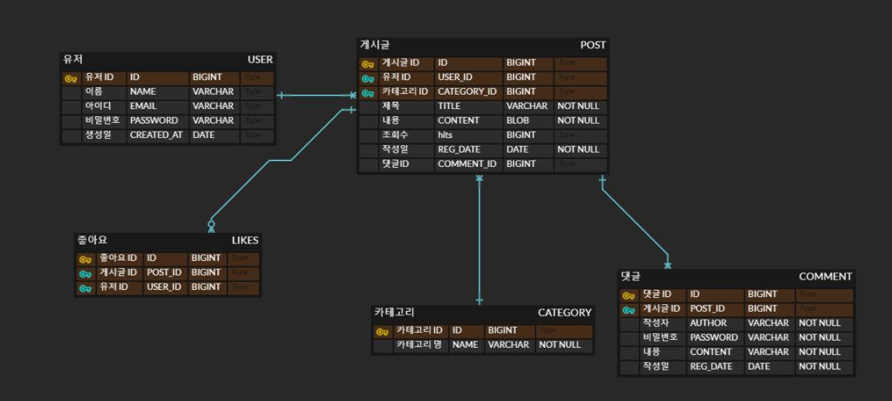

# 이노로그 (개인블로그)

## 🔆 프로젝트 설명 및 후기
    개인 블로그를 통하여 카테고리, 게시글, 댓글을 관리하여 운영하는 애플리케이션.
    spring scurity, spring jpa에 대해 공부하고자 만들었던 토이프로젝트이다.
    개인 권한을 부여하여 `MethodSecurityExpressionHandler`을 활용하여 메소드 수준의 보안 역할을 검증하였습니다.
    entity 설계 및 querydsl 사용으로 ORM 작성에 용이했고 간단하게 구현이 가능했다.
    vue3 Vite를 사용하여 빠른 속도의 장점을 느껴보았으며, 라이프사이클의 관리로 템플릿 구성이 용이했다.
    element-plus UI 프레임워크를 사용해 화면단 구성을 보다 쉽게 구현하였습니다.

## 🌍 개발 환경

    Gradle Project
    Java 17
    SpringBoot: 3.2.2

    Dependencies :
        Spring Boot Data Jpa
        Spring Security
        crypto: Scrypt 암호화
        querydsl
        Spring Restdocs : API 문서 작성
        Lombok
        H2 DataBase

    Vue3 dependencies :
        @js-joda/core: 5.6.3 // 날짜 포맷
        bootstrap: ^5.3.3
        class-transformer: ^0.5.1 // 파싱 관련
        element-plus: ^2.7.6 // css 프레임워크
        normalize.css: ^8.0.1
        pinia: ^2.1.7 // 상태관리 (vuex 와 비슷)
        reflect-metadata: ^0.2.2
        tsyringe: ^4.8.0 // DI 관련
        vue: ^3.4.29
        vue-router: ^4.3.3

## 👌 기능 정리 
    1. 관리자
    - 로그인 및 게시글 권한 설정
    - 게시글 작성, 수정, 삭제 권한
    - 카테고리 관리

    2. 게시글
        2-1. 조회수
        - 무한정 조회 방지를 위해 자정 제한 쿠키 생성 (postHits)
        2-2. 좋아요
        - 게시글마다 유저마다 좋아요 할 수 있도록 추가

    3. 게시글 댓글
    -  조회, 작성, 삭제 ( 비밀번호 관리 )

    4. 게시글 작성
    - vue3 + Quill 에디터 사용

    => 추가 예정
    - 게시글 에디터 사용 ( 이미지 포함 )
    - 후원기능

## 🏀 ERD 설계도

## 💎 API 문서
[index.html](src/main/resources/static/docs/index.html)